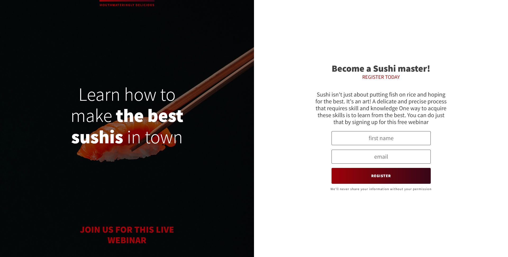

# Sushi Splash Page

Fully responsive splash page that allows you to register to an upcoming webinar, build with HTML and CSS

## Table of contents

- [Screenshot](#screenshot)
- [Links](#links)
- [Built with](#built-with)
- [Installation](#installation)
- [Author](#author)

## Screenshot

## Links

- Solution URL: [Github](https://github.com/fatima-xs/sushi-splash-page)
- Live Site URL: [Netlify](https://sushi-splash-fatima.netlify.app/)

## Built with

## Installation

- Clone this repository to your desktop
- Navigate to the top level of the directory
- Open ./index.html in your browser

## Author

### Fatimata Ndiaye

